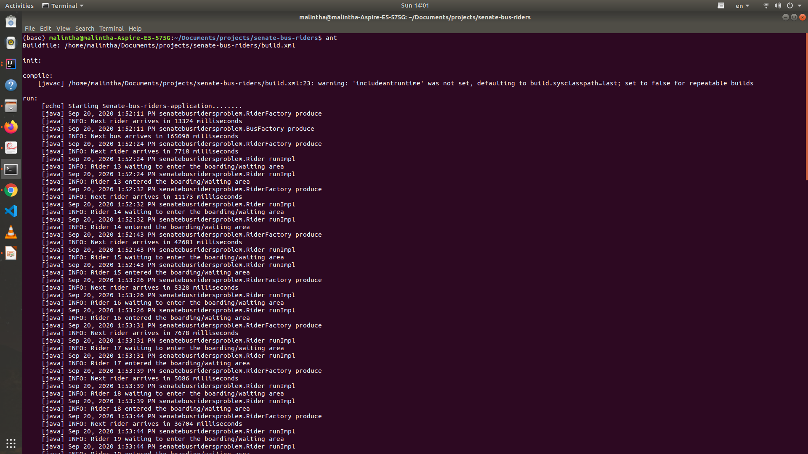
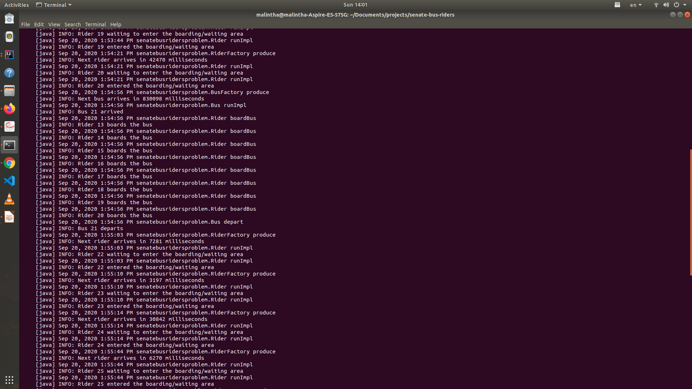

## senate-bus-riders
Solution to Senate bus riders problem of synchronization using java.

###### Steps to run senate-bus-riders application
1. Using `ant` command

    Prerequisite:
    1. ['ant'](https://ant.apache.org/) installation
    2. jdk 1.8 or higher

    In a terminal/shell go to the **project's root** directory and execute `ant` command.

2. Compile and run manually using java
    
    Prerequisite:
    1. jdk 1.8 or higher

    step1: Go to the  **project's root**  directory and compile the java program
    
        `javac -d temp  src/senatebusridersproblem/*.java`
    step2: Execute the program
        
        `java -cp temp  senatebusridersproblem.SenateBusRiders`
